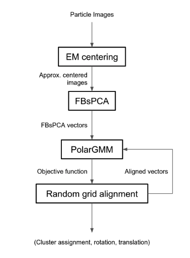
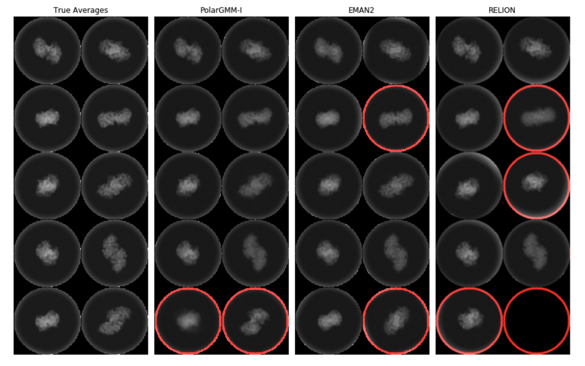

# Novel Event Signature Detection

Novel Event Signature Detection encompasses the discovery, analysis, and
interpretation of underlying patterns and information signatures within
complex data structures. Our first two method was discussed already in
section [DeblurSR](../signature-detection.html#deblursr-event-based-motion-deblurring-under-the-spiking)
and [Learning
Transferable Cloaks](../integration.html#learning-transferable-3d-adversarial-cloaks-for-deep-trained-detectors).
Two additional
cutting-edge methodologies are at the forefront of current research:
Higher Order Feature Selection (HOFS) and Probabilistic PolarGMM. These
methods, outlined below, exemplify advancements in feature selection,
unsupervised clustering, and noisy projection image analysis.

The novel contributions in event signature detection showcase the
continuous innovation in the realms of feature selection and
unsupervised learning. By advancing mutual information approximation
techniques and unsupervised clustering methods, the highlighted research
propels the understanding of complex patterns within data. The extension
of traditional methodologies to higher-order constructs and
probabilistic models marks a significant progression in the field,
broadening the horizons for future exploration and application. These
advancements not only serve to enrich the current landscape of data
analytics but also pave the way for more sophisticated and nuanced
analyses in various domains.

### HOFS: Higher Order Mutual Information Approximation for Feature Selection in R

Feature selection is a pivotal step in predictive modeling, where
relevant features must be identified to enhance model quality
(Gajowniczek et al., 2022). HOFS presents a novel approach to this task,
utilizing higher-order mutual information (MI) approximation. Contrary
to existing methods, which often lead to locally optimal selections:

1. **Higher Order Approximation:** HOFS employs a higher order MI-based
   technique, bypassing the limitations of the traditional lower order
   approximation.

2. **Ranked Collection:** Instead of a single list, HOFS provides a
   ranked collection of feature subsets that maximizes MI, thereby
   acknowledging interdependent features.

3. **Performance Excellence:** The proposed method outshines existing
   feature selection approaches, maintaining similar running times and
   computational complexity while delivering more nuanced feature
   ranking.

This methodology extends the boundaries of feature selection, allowing
for the identification of non-local feature combinations and fostering a
deeper understanding of their interdependence.

### Probabilistic PolarGMM: Unsupervised Cluster Learning of Very Noisy Projection Images of Unknown Pose

In the domain of cryogenic electron microscopy (Cryo-EM), unsupervised
clustering and alignment play a significant role in inferring
orientations and grouping similar images
(Chockchowwat & Bajaj, 2022). The Probabilistic PolarGMM methodology
introduces:

1. **Fourier-Bessel Steerable PCA:** An efficient, adaptable, low-rank
   rotation operator, extended to handle translations, serves as the
   foundational representation.

2. **Unsupervised Learning:** Utilizing a probabilistic
   polar-coordinate Gaussian mixture model, soft clusters are learned
   through an expectation-maximization (EM) algorithm.

3. **Robust Alignment:** The method exhibits robustness against
   alignment imperfections, enhancing the reliability of rotational
   clusters.

Multiple benchmarks demonstrate the superiority of probabilistic
PolarGMM against standard Cryo-EM tools in various clustering metrics
and alignment errors, affirming its potential for improved performance
in very noisy projection image analysis. The pipeline is shown in figure 1 and
some results are shown in figure 2.

<figure id="PolarGMMPipeline">

<figcaption>Figure 1: Probabilistic PolarGMM pipeline.</figcaption>

</figure>

<figure id="PolarGMMResults">

<figcaption>Figure 2: Class averages from 70S-T. Averages with faulty features,

blurry, or missing are marked with red circles.</figcaption>

</figure>

#### References

- Gajowniczek, K., Wu, J., Gupta, S., & Bajaj, C. (2022). HOFS: Higher order
  mutual information approximation for feature selection in R. SoftwareX, 19, 101148.

- Chockchowwat, S., & Bajaj, C. L. (2022). Probabilistic PolarGMM: Unsupervised
  Cluster Learning of Very Noisy Projection Images of Unknown Pose. ArXiv
  Preprint ArXiv:2206.12959.